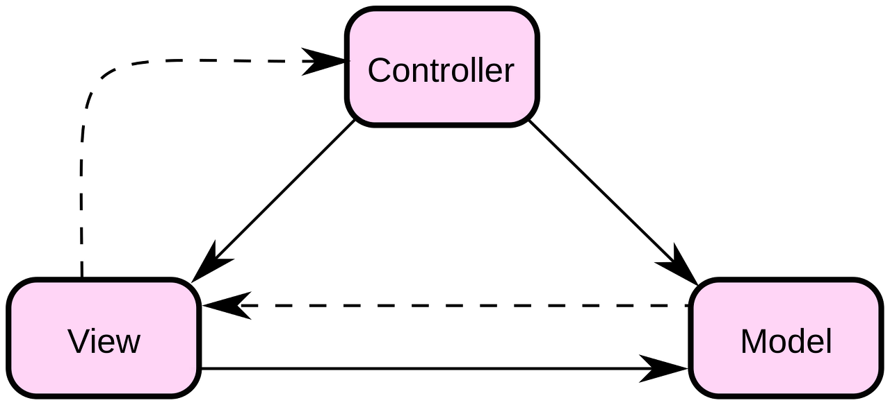

# Streamer Times
### Node.js installation : choco install nodejs-lts
- **by using Chocolately software**

 

### NPM ( Node Package Manager )
- **Express installation : npm install express**
- **Babel installation : npm install @babel/nodeode** + **npm install @babel/preset-env**
- **Nodemon : npm install nodemon -D** for auto restart when I save something

- **Pug installation : npm install pug**

Addition to ".gitignore" ( for nodejs and package-lock.json )

 

### Middleware
- **Morgan installation : npm install morgan** for logging
- **Helmet installation : npm install helmet** for security of node.js
- **body-parser installation : npm install body-parser** for form data to server 
- **cookie-parser installation : npm install cookie-parser** for cookie

 

### Router

 

### MVC Pattern

- **Model** *Data*
- **View** *How does the data look*
- **Control** *Function that looks for the data*

 

### Mixin : recycling of repeated codes

 

### MongoDB : choco install mongodb
- **by using Chocolately software**

 

### Mongoose : npm install mongoose
- **an object module for node.js**  ***(connection to DB)***
- **dotenv installation : npm install dotenv** for hiding DB URL